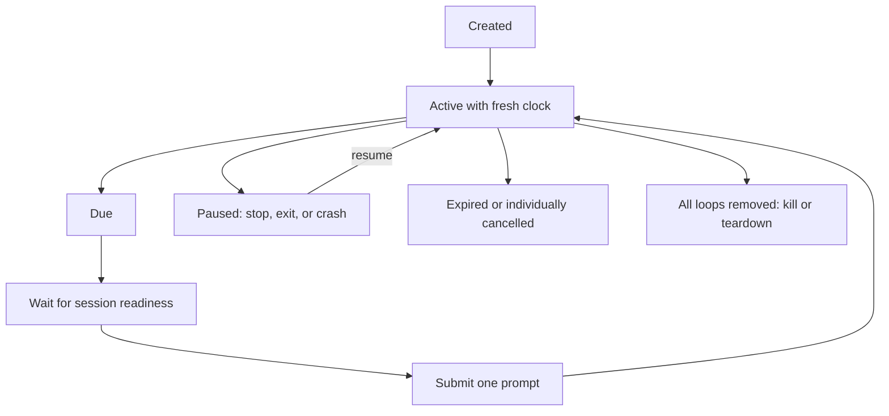
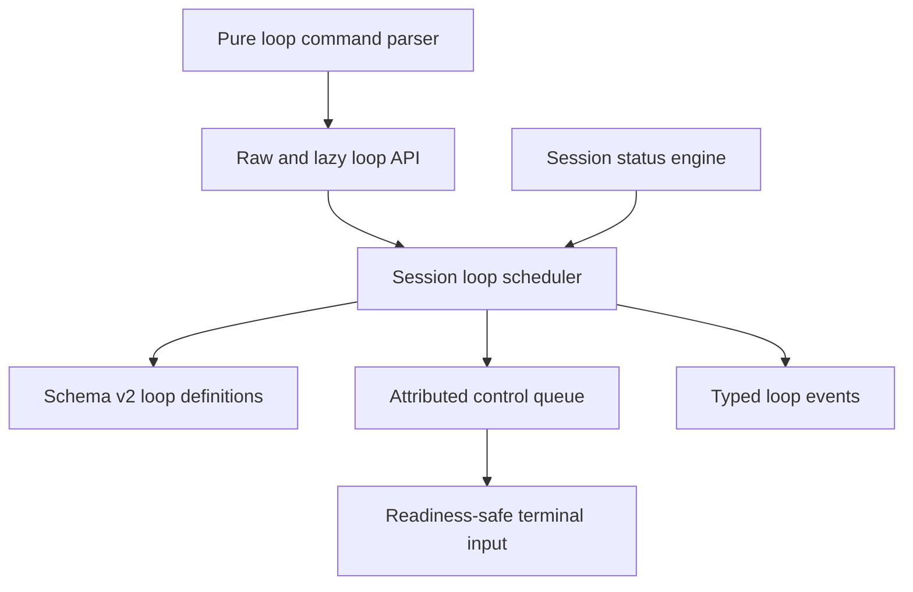
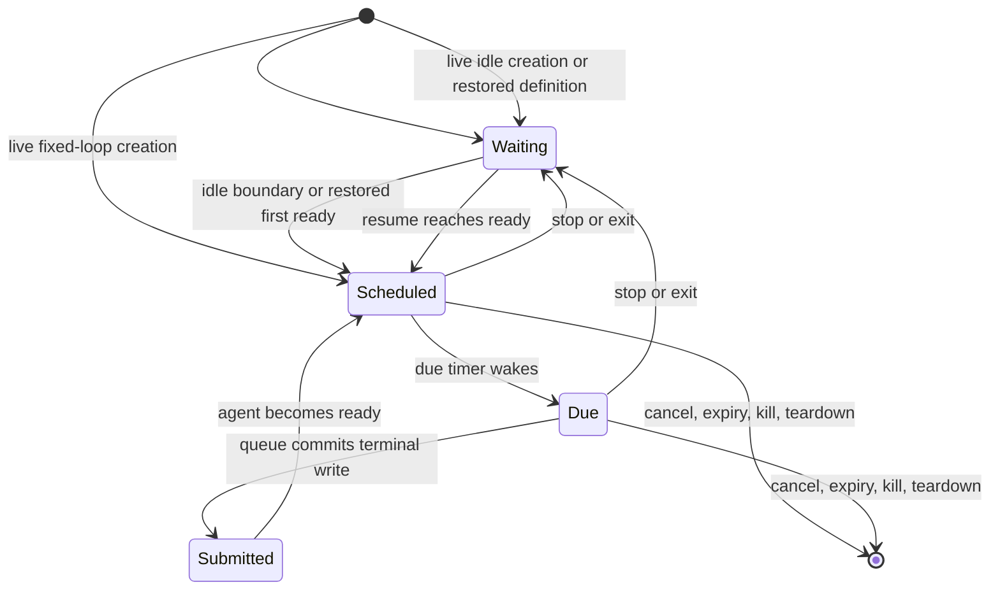

# Unified Session Loops - Plan

## Goal Capsule

- **Objective:** Elwood callers can schedule and manage recurring prompts with the same reliable behavior in Claude and Codex sessions, including recovery after a stopped process or machine crash.
- **Means:** Add an `AgentSessionBase`-owned scheduler, persisted loop definitions, attributed queue submissions, a typed management API, and an explicit `/loop` parser helper. (KTD1-KTD4)
- **Product authority:** This plan defines the loop behavior that the Elwood PRD and public session API must adopt.
- **Open blockers:** None.

---

## Product Contract

### Summary

Elwood will own a shared recurring-prompt facility for Claude and Codex sessions.
Each session can hold multiple fixed-interval or idle loops that callers can create, inspect, and cancel, with definitions persisted for resume and removed by permanent termination.

### Problem Frame

Claude Code has native session scheduling, while Codex has no equivalent documented `/loop` command.
Forwarding native commands would give callers different capabilities and lifecycle semantics depending on the wrapped agent.
Parent applications can build their own timers, but that duplicates the readiness, serialization, session persistence, and teardown behavior Elwood already centralizes.

### Actors

- A1. **Elwood caller:** A library consumer such as Coal Harbor that creates, lists, cancels, and presents loops.
- A2. **Elwood session scheduler:** The adapter-neutral authority for loop timing, persistence, delivery, and lifecycle events.
- A3. **Wrapped agent session:** A Claude or Codex conversation that receives each scheduled prompt as an ordinary readiness-safe message.

### Key Decisions

- **Elwood owns scheduling.** (session-settled: user-directed — chosen over native adapter commands or parent-owned timers: one authority gives Claude and Codex the same behavior.) Governs R1, R8, R9.
- **Creation is explicit.** (session-settled: user-directed — chosen over intercepting `sendMessage`: caller messages must never be reinterpreted implicitly.) Governs R2, R3.
- **The two cadence modes are deterministic.** (session-settled: user-directed — chosen over agent-selected adaptive timing: fixed and idle timing are predictable across adapters.) Governs R5, R6, R7.
- **Resume starts fresh clocks.** (session-settled: user-directed — chosen over catch-up or preserved phase: a resumed session should not replay missed work.) Governs R11, R12.
- **Safety limits are built in.** (session-settled: user-approved — chosen over unlimited, unjittered, non-expiring loops: forgotten or synchronized loops should have bounded impact.) Governs R4, R7, R13.
- **Idle loops remain independent.** (session-settled: user-directed — chosen over resetting or restricting peer loops: multiple idle loops must not starve one another.) Governs R6, R9.
- **Management starts with inspection and cancellation.** (session-settled: user-approved — chosen over adding pause, edit, and run-now controls in the first version: cancel-and-recreate covers replacement without broadening the lifecycle.) Governs R15, R17, R18.

The lifecycle is intentionally asymmetric:



### Requirements

**Public creation and parsing**

- R1. The common Claude/Codex raw and lazy session surfaces MUST expose asynchronous `createLoop`, `listLoops`, and `cancelLoop` operations for multiple Elwood-owned loops without using adapter-native scheduling commands.
- R2. `createLoop` MUST accept a readonly discriminated fixed-or-idle request, while a standalone `parseLoopCommand` helper recognizes `/loop <message>` and `/loop <interval> <message>` into the same request type; `sendMessage` and `sendPrompt` MUST retain their existing literal-message behavior.
- R3. The parser MUST treat the first whitespace-delimited token after `/loop` as an interval only when it is a positive integer followed by `s`, `m`, `h`, or `d`; otherwise the entire remainder is the idle-loop message.
- R4. Fixed intervals MUST be at least one minute and less than seven days, messages MUST contain 1 to 65,536 UTF-8 bytes, and a session MUST reject creation beyond 50 active loops without evicting an existing loop; an accepted interval near the expiry horizon can expire before its first submission.

**Cadence and delivery**

- R5. A fixed loop MUST first become due one requested interval after creation and MUST submit through the ordinary readiness-safe message path.
- R6. An idle loop MUST become due after five continuous minutes without non-loop session activity; non-loop activity resets every idle loop, while a loop-generated turn rearms only its originating loop from the ready transition that completes that turn and does not reset its peers.
- R7. Every due time MUST include a stable delay-only offset derived from the loop ID in the range `0..min(10% of the interval, 30 seconds)`, so a loop never fires earlier than its requested interval and retains the same offset across resume.
- R8. A loop that becomes due while the live session is running, blocked, or otherwise unable to accept a message MUST submit at most once when that session next becomes ready; missed occurrences MUST NOT accumulate, and an unsubmitted due state MUST be discarded if the session stops or exits.
- R9. Due loops MUST submit serially, one committed turn per ready transition, ordered by due time with a stable tie-breaker; delivery latency can scale with due-loop count and agent turn duration without a separate wall-clock deadline, and a delayed fixed loop MUST begin its next full interval from submission rather than the former phase.
- R10. A live scheduling or submission failure MUST emit failure evidence and rearm the loop from a fresh interval unless the session has become non-live, in which case the persisted loop pauses for resume.

**Persistence and terminal lifecycle**

- R11. Each loop definition MUST persist stable identity, cadence, prompt, jitter, creation time, and expiration information without persisting a live timer; the persisted jitter is authoritative on restore, while ID derivation is used only at creation.
- R12. Starting a resumed session MUST discard missed runs and give every unexpired restored loop a fresh fixed or idle clock beginning from restored session readiness.
- R13. Every loop MUST expire seven wall-clock days after its original creation, including downtime, and expiry observed before submission wins over a pending due time; live expiry emits an event, while resume and stopped/exited management prune already-expired definitions silently before returning.
- R14. `stop`, unexpected agent exit, and process failure MUST preserve loop definitions for resume, while `kill` MUST permanently clear them and `teardown` MUST remove them with the rest of the session state.

**Inspection, cancellation, and events**

- R15. `listLoops` MUST return snapshots ordered by creation time then ID, where each snapshot exposes its stable ID, exact message, cadence mode, fixed interval in milliseconds when applicable, stable jitter, creation and expiration times, `waiting | scheduled | due | submitted` scheduling state, and next known due time only when scheduled.
- R16. The shared session `loop` event MUST use the variant contract below with an `ElwoodLoopEventSnapshot` equal to the R15 snapshot without `message`, and MUST NOT contain the stored message or serialized request.
- R17. Cancelling a known loop MUST prevent every future submission and remove its persisted definition; if its prompt has already been submitted, cancellation MUST NOT interrupt that active agent turn.
- R18. Cancelling an unknown or already-finished loop MUST produce an explicit not-found result rather than affecting another loop.

**Management, safety, and compatibility**

- R19. Invalid input, capacity exhaustion, unknown cancellation, write-side loop persistence, and scheduled submission MUST use stable `invalid_loop`, `loop_limit_reached`, `loop_not_found`, `loop_persistence_failed`, and `loop_submission_failed` codes; malformed sidecar reads use existing `state_corrupt`, and errors/details MUST identify a loop only by ID without stored prompt text.
- R20. `listLoops` and `cancelLoop` MUST remain available on a stopped or exited low-level session, while creation requires a live session; lazy session methods follow the existing lazy-start contract, and each scheduled prompt uses the submitting session's current permissions and blocking-dialog readiness gates, including the resumed posture rather than the creation-time posture.
- R21. The core schema-version-1 session record MUST remain backward-readable, while a versioned loop sidecar stores exact validated definitions with mode `0600` under the owner-only session directory; an absent sidecar means no loops, and malformed, unexpectedly owned, or group/world-accessible sidecar data MUST reject resume as `state_corrupt` rather than being restored.

#### Loop event variants

| Kind | Required payload | Snapshot | Failure data |
|---|---|---|---|
| `created` | Loop ID, redacted loop metadata, event time | Redacted; no message | Absent |
| `fired` | Loop ID, redacted loop metadata, scheduled due time, submission time | Redacted; state is `submitted` | Absent |
| `cancelled` | Loop ID, cancellation time, `caller | kill | teardown` reason | Absent | Absent |
| `expired` | Loop ID, expiry time | Absent | Absent |
| `failed` | Loop ID, failure time, `persistence | scheduling | submission` phase | Redacted when the loop remains | Stable code and bounded message |

### Key Flows

- F1. Create and run a fixed loop
  - **Trigger:** A1 submits a valid interval and message through the typed API or maps parser output into that API.
  - **Steps:** A2 persists the definition, returns its snapshot, waits for the interval plus jitter, and sends one message when A3 is ready.
  - **Outcome:** The loop rearms from the actual submission time and continues until cancellation, expiry, kill, or teardown.
  - **Covered by:** R1-R5, R7-R10, R15-R16.
- F2. Run multiple idle loops fairly
  - **Trigger:** A3 remains free of non-loop activity for five minutes plus each loop's jitter.
  - **Steps:** A2 marks loops due independently, orders them deterministically, and delivers at most one on each ready transition without letting one loop reset its peers.
  - **Outcome:** Every due idle loop eventually runs without overlapping turns or starving behind the smallest jitter.
  - **Covered by:** R6-R9.
- F3. Restore after stop, exit, or crash
  - **Trigger:** A caller resumes a session whose state contains unexpired loop definitions.
  - **Steps:** A2 removes expired definitions, restores stable identities and jitter, waits for session readiness, and starts fresh clocks without replaying missed runs.
  - **Outcome:** The resumed session is close to its prior managed state without a catch-up burst.
  - **Covered by:** R7, R11-R14.
- F4. Cancel or permanently terminate
  - **Trigger:** A1 cancels one loop, kills the session, or tears it down.
  - **Steps:** A2 removes the applicable persisted definitions and stops future timers; an already-submitted turn is left alone.
  - **Outcome:** Cancel affects one loop, while kill and teardown permanently stop all loops for that session.
  - **Covered by:** R14, R16-R18.

### Acceptance Examples

- AE1. Parse deterministic slash syntax
  - **Covers R2-R4.**
  - **Given:** `/loop 5m check the deployment` and `/loop check the deployment`.
  - **When:** The parser helper reads each input.
  - **Then:** The first produces a five-minute fixed-loop request and the second produces an idle-loop request carrying the complete message.
- AE2. Coalesce a late fixed loop
  - **Covers R5, R7-R9.**
  - **Given:** A five-minute loop becomes due during a ten-minute agent turn.
  - **When:** The agent next becomes ready.
  - **Then:** Elwood submits the message once and schedules the following run a full five minutes plus its stable jitter after that submission.
- AE3. Preserve independent idle loops
  - **Covers R6, R9.**
  - **Given:** Twenty idle loops have reached their five-minute threshold with different stable jitter offsets.
  - **When:** One loop runs and the agent returns to ready.
  - **Then:** The originating loop rearms, peer loops retain eligibility, and due peers continue one per committed turn in deterministic order; a candidate that settles before committing immediately releases the next peer while readiness remains available.
- AE4. Resume without catch-up
  - **Covers R11-R14.**
  - **Given:** A session with active loops is stopped or its host crashes for several hours.
  - **When:** The session resumes before the loops expire.
  - **Then:** The same loop IDs and jitter return, no missed message is submitted, and every cadence begins from the resumed ready state.
- AE5. Apply wall-clock expiry
  - **Covers R13.**
  - **Given:** A session remains stopped past a loop's seventh day.
  - **When:** The caller resumes it.
  - **Then:** The expired loop is absent and never submits a catch-up message.
- AE6. Cancel during an active loop turn
  - **Covers R17-R18.**
  - **Given:** A loop's prompt has already started an agent turn.
  - **When:** A1 cancels that loop by ID.
  - **Then:** The current turn continues, the definition is removed, and no future run occurs.
- AE7. Enforce bounded capacity
  - **Covers R4.**
  - **Given:** A session already has 50 active loops.
  - **When:** A1 creates another.
  - **Then:** Creation fails explicitly and all 50 existing loops remain unchanged.

### Scope Boundaries

- The first version excludes agent-selected adaptive cadence, even though Claude can choose its own interval natively.
- The first version excludes bare `/loop` maintenance prompts, one-time reminders, cron expressions, and natural-language interval phrases.
- The first version excludes pause, edit, and run-now operations; callers replace a loop by cancelling and creating another.
- Loops never continue independently after `kill` or `teardown`; durable machine-independent schedulers remain parent-application or hosted-platform concerns.
- Elwood does not import or reconcile Claude-native scheduled tasks exposed through Claude hook payloads.
- Concurrent processes controlling the same persisted session remain unsupported; this feature does not add a cross-process session lease.

### Dependencies and Assumptions

- The existing shared readiness queue remains the authority for safe one-message-per-turn submission.
- Session state remains available after `stop`, unexpected exit, or host failure and is deleted by `teardown`.
- Wall-clock timestamps govern seven-day expiry, while live scheduling avoids treating clock movement as permission to replay missed work.

### Sources and Research

- `src/core/agent-session.ts` confirms the common session surface has no recurring API today.
- `src/core/control-queue.ts` and `src/core/control-queue-traits.ts` define readiness-safe, one-operation-at-a-time message delivery.
- `src/state/store.ts` and `src/state/validate.ts` define the current persisted session record and its allowlisted fields.
- `src/claude/hook-events.ts` exposes Claude-native scheduled-task observations without a shared callable scheduler.
- [Claude Code scheduled tasks](https://code.claude.com/docs/en/scheduled-tasks) documents native `/loop` behavior and lifecycle limits.
- [Codex developer commands](https://developers.openai.com/codex/cli/slash-commands) documents the current Codex CLI command surface without `/loop`.

---

## Planning Contract

### Key Technical Decisions

- KTD1. **Own one scheduler in the shared runtime.** `AgentSessionBase` composes a focused loop scheduler so both adapters share timing, persistence, readiness, and terminal behavior. (session-settled: user-directed — chosen over native Claude scheduling or parent timers: Elwood must provide one cross-adapter contract.) Governs R1, R5-R14, R20.
- KTD2. **Persist definitions in a versioned sidecar.** Keep the core session record backward-readable and store validated definitions in a private loop sidecar, while one-shot timers and live due/submission state remain memory-only. Governs R7, R11-R14, R21.
- KTD3. **Attribute and cancel queued loop messages through submission commit.** Extend the shared control queue with internal caller-or-loop origin, dispatch notification, and cancellation that remains armed through paste settlement; cancellation before the first successful Enter clears staged composer text, and loop-origin running evidence is deferred until that Enter succeeds. This closes the paste-to-Enter race that a dispatch-time liveness check would leave open. Governs R5-R10, R16-R18, R20.
- KTD4. **Use injected one-shot scheduling seams.** The scheduler owns unreferenced one-shot due and expiry timers with injected clock, timer, and ID seams for deterministic race tests; fixed clocks re-anchor only after submission settles. Governs R5-R13.
- KTD5. **Treat a turn's dispatch origin as its activity provenance.** Successful caller prompt, message, and guidance submissions reset every idle loop; unattributed running evidence and raw input are caller activity, while a tracked loop turn rearms only its origin. Governs R6, R9.
- KTD6. **Commit durable state before observable loop state.** Create, cancel, live expiry, and kill clearing write the next immutable record before updating scheduler snapshots or emitting events; shutdown still attempts process termination when persistence fails and reports the failure. Governs R10-R14, R16-R19.
- KTD7. **Preserve shared FIFO priority and pump ready peers.** One due loop candidate enters the existing queue at a time; work already queued stays ahead, later work stays behind, and due-loop ties use due time then ID. If that candidate settles before committing a turn, the scheduler immediately pumps the next due peer while readiness remains available. Governs R8-R9, R17.

### High-Level Technical Design

The scheduler is adapter-neutral and observes internal status transitions rather than relying on public event listeners.



Each definition has a durable lifecycle and a separate live scheduling lifecycle.



The queue defines the cancellation boundary and readiness ordering.

```mermaid
sequenceDiagram
  participant T as Timer
  participant S as Scheduler
  participant Q as Control queue
  participant P as PTY
  T->>S: mark loop due
  S->>Q: enqueue attributed cancellable message
  Q-->>S: wait behind prior FIFO work/readiness
  alt cancelled before first Enter
    S->>Q: abort queued operation
    Q->>P: clear staged composer if needed
    Q-->>S: settle without submission; pump next due peer
  else session ready
    Q->>P: paste and Enter
    P-->>Q: submission resolved
    Q-->>S: fired commit
  end
```

### Assumptions

- The existing single-live-owner session assumption remains in force; persistence coordinates resume, not simultaneous processes.
- Exact loop messages are submitted without a provenance envelope, so agent-visible behavior matches an ordinary caller message.
- Expiry wins when observed before submission; expired definitions found during resume are pruned without replaying live-only events.
- A throwing public event listener is telemetry failure only and cannot roll back committed scheduler or queue state.

### System-Wide Impact

- **Public API:** Common, adapter-specific, and lazy session types gain the same management methods and loop event. The parser is a root export and remains opt-in.
- **Persistence:** A private versioned sidecar stores explicitly requested automation prompts and wall-clock timestamps without changing the backward-readable core session record. Existing ordinary prompt and transcript privacy rules remain unchanged.
- **Queue and readiness:** Internal operation provenance and cancellation extend the single shared queue. Existing caller FIFO, image attachment, guidance overtaking, login exclusivity, and blocked-dialog behavior must remain intact.
- **Lifecycle:** The scheduler observes committed status transitions, stops all timers on terminal states, preserves definitions only for resumable termination, and joins the existing attempt-all shutdown discipline.
- **Consumers:** Coal Harbor can revendor Elwood and manage loops without adding a scheduler. No parent-specific protocol, background service, or adapter-native command is introduced.

### Risks and Mitigations

| Risk | Mitigation |
|---|---|
| Loop-state migration corrupts or silently drops durable state | Versioned sidecar validation, absent-file compatibility, whole-file rejection, private atomic writes, and round-trip/corruption tests |
| A cancel/due/ready race submits after cancellation | Queue-level cancellation keyed to the operation and a tested successful-write commit boundary |
| A timer or listener exception wedges scheduling | One-shot timer containment, event-listener isolation, and authoritative snapshot reconciliation |
| Kill clears state but fails to terminate, or terminates but fails to clear state | Attempt both durable clearing and existing reap/cleanup work; return a stable typed failure until a retry completes both |
| Idle loops starve or reset each other | Actual-dispatch origin tracking, deterministic due ordering, and one candidate per ready transition |
| Scheduled work bypasses a human gate | Reuse the existing readiness queue and test blocked trust/permission-dialog release for both adapters |
| Concurrent processes duplicate deliveries | Preserve and document the existing single-live-owner assumption; defer a cross-process lease |

### Output Structure

```text
src/core/loops/
├── constants.ts
├── jitter.ts
├── parser.ts
├── scheduler.ts
├── scheduler-state.ts
├── timers.ts
├── types.ts
└── validate.ts
src/core/simple/
└── loop-controls.ts
src/state/
├── loop-store.ts
└── validate-loops.ts
```

---

## Implementation Units

### U1. Specify the public loop and persistence contract

- **Goal:** Make the PRD the authoritative description of loop APIs, errors, events, scheduling, lifecycle, and schema migration.
- **Requirements:** R1-R21; F1-F4; AE1-AE7.
- **Dependencies:** None.
- **Files:** `PRD.md`, `CHANGELOG.md`, `README.md`, `docs/embedding.md`, `docs/cli-behavior.md`.
- **Approach:** Update the specification before source code. Preserve the privacy guarantee for ordinary messages while naming loop prompts as explicit persisted automation state. Document the stop-versus-kill distinction and lazy/raw surfaces.
- **Test scenarios:** Test expectation: none — this unit defines the contract implemented and proven by later units.
- **Verification:** Documentation uses the same names, bounds, lifecycle, and schema rules as the Product Contract without leaving the former no-prompts/no-timestamps statements in conflict.

### U2. Add loop domain types, parser, validation, and jitter

- **Goal:** Establish a pure, exported loop domain that all adapters and persistence use.
- **Requirements:** R2-R4, R7, R15-R19; AE1, AE7.
- **Dependencies:** U1.
- **Files:** `src/core/loops/constants.ts`, `src/core/loops/types.ts`, `src/core/loops/parser.ts`, `src/core/loops/validate.ts`, `src/core/loops/jitter.ts`, `src/core/errors.ts`, `src/index.ts`, `tests/unit/loop-parser.test.ts`, `tests/unit/loop-validation.test.ts`, `tests/unit/loop-jitter.test.ts`.
- **Approach:** Keep syntax parsing separate from creation bounds so interval-shaped input can parse and then reject consistently. Use integer arithmetic and a stable ID hash with no runtime dependency.
- **Execution note:** Implement the pure behavior test-first, including every bound and ambiguous parser token.
- **Test scenarios:**
  - Covers AE1. Parse fixed and idle examples into directly consumable discriminated requests.
  - Return `undefined` for non-loop input and reject a missing message.
  - Treat non-positive or non-matching tokens as idle message text, but reject a parsed fixed interval below one minute or at least seven days.
  - Reject empty messages and values that overflow safe integer conversion.
  - Produce a deterministic delay-only jitter within the required cap for each loop ID.
- **Verification:** Public exports are readonly, parser and validation outcomes are typed, and pure tests cover valid, boundary, invalid, and stability cases.

### U3. Migrate and validate persisted loop definitions

- **Goal:** Store durable loop definitions without persisting runtime timer state or making core session records unreadable to older Elwood versions.
- **Requirements:** R4, R7, R11-R14, R19, R21; AE4, AE5, AE7.
- **Dependencies:** U2.
- **Files:** `src/state/store.ts`, `src/state/loop-store.ts`, `src/state/validate-loops.ts`, `tests/unit/state-store.test.ts`, `tests/unit/loop-store.test.ts`, `tests/unit/loop-state-validate.test.ts`.
- **Approach:** Keep session records at schema version 1 and add an independently versioned private loop sidecar. Validate ownership/mode, exact loop fields, unique IDs, count, message byte bounds, interval bounds, timestamps, jitter invariants, and expiry relation before returning fresh definitions.
- **Execution note:** Add compatibility and corruption characterization tests before connecting the sidecar to session startup.
- **Test scenarios:**
  - Read a valid version-1 Claude or Codex record unchanged when a loop sidecar is absent.
  - Round-trip valid fixed and idle sidecar definitions while stripping unknown fields.
  - Reject duplicate IDs, excess definitions, malformed modes, out-of-bound messages/intervals, unsafe timestamps, invalid jitter, and inconsistent expiry.
  - Reject a sidecar with unexpected ownership or group/world permission bits.
  - Preserve the existing exclusion of ordinary prompts, metadata, credentials, runtime paths, warnings, status, and terminal state.
- **Verification:** Existing core records remain backward-readable, sidecar writes are atomic/private, and malformed loop data produces `state_corrupt` through the public read path.

### U4. Make readiness-queued loop delivery attributable and cancellable

- **Goal:** Give scheduled messages a safe pre-dispatch cancellation boundary and causal origin without changing existing operation ordering.
- **Requirements:** R5-R9, R17, R20; AE2, AE3, AE6.
- **Dependencies:** U2.
- **Files:** `src/core/control-queue.ts`, `src/core/control-queue-types.ts`, `src/core/control-queue-traits.ts`, `tests/unit/control-queue-cancel.test.ts`, `tests/unit/control-queue.test.ts`, `tests/unit/control-queue-lifecycle.test.ts`.
- **Approach:** Generalize queued and in-flight pre-commit cancellation without corrupting bypass accounting. Carry internal submission origin and expose committed/cancelled/failed notification seams; U6 consumes that provenance for status and idle behavior. Keep cancellation armed through paste settlement and clear staged content on a pre-Enter abort.
- **Execution note:** Start from failing tests for cancellation before dispatch, during dispatch, and after commit, then exercise composer clearing against both real adapter TUIs before building the full scheduler on this boundary.
- **Test scenarios:**
  - Cancel a readiness-waiting loop message and prove it never reaches the submitter.
  - Cancel after paste but before Enter, clear the composer, and prove no turn begins; cancellation after Enter leaves the active turn intact.
  - Preserve guidance overtaking, image attachment, exclusive login, close, failure rollback, and FIFO behavior.
  - Report caller and loop origins at the actual dispatch boundary without letting a throwing observer wedge the queue.
- **Verification:** Existing queue conformance remains unchanged, cancellation affects only the targeted queued operation, and attributed dispatch has deterministic ordering.

### U5. Implement the loop scheduler state machine

- **Goal:** Implement fixed, idle, coalescing, expiry, retry, cancellation, and event behavior behind injected deterministic seams.
- **Requirements:** R4-R18; F1-F4; AE2-AE7.
- **Dependencies:** U2-U4.
- **Files:** `src/core/loops/scheduler.ts`, `src/core/loops/scheduler-state.ts`, `src/core/loops/timers.ts`, `tests/unit/loop-scheduler-fixed.test.ts`, `tests/unit/loop-scheduler-idle.test.ts`, `tests/unit/loop-scheduler-lifecycle.test.ts`, `tests/unit/loop-scheduler-failures.test.ts`.
- **Approach:** Use one-shot unreferenced timers and an immutable definition map. Persist before create/cancel/expire/clear commits. Keep due, queued, active-origin, and next-run data live-only. Queue one due candidate and apply KTD7 after every committed turn or pre-turn settlement.
- **Execution note:** Drive the scheduler with fake time and explicit persistence/queue failures before connecting it to a real session.
- **Test scenarios:**
  - Covers AE2. Coalesce a fixed loop delayed by a long turn and re-anchor after one successful submission.
  - Covers AE3. Rearm an originating idle loop without resetting due peers, then drain peers one per ready transition.
  - Covers AE5. Expire live and restored definitions at the seven-day wall-clock boundary.
  - Covers AE6. Cancel waiting, due, queued, and already-submitted loops with the specified boundary.
  - Pump the next due peer immediately when the selected candidate is cancelled, expires, or fails before consuming readiness.
  - Covers AE7. Reject a fifty-first loop without mutating the existing set.
  - Reset every idle loop on caller-origin activity, but not on loop-origin activity, warnings, or administration.
  - Emit created/fired/cancelled/expired/failed after committed state changes and contain throwing listeners.
  - Rearm from failure time while live, but pause without runtime due state after terminal shutdown.
- **Verification:** Fake-time tests prove every scheduler state transition, race boundary, ordering rule, failure branch, and timer cleanup path.

### U6. Integrate scheduling with shared session lifecycle and shutdown

- **Goal:** Connect the scheduler once in the common runtime so Claude and Codex inherit identical behavior.
- **Requirements:** R1, R5-R14, R16-R21; F2-F4; AE3-AE6.
- **Dependencies:** U3-U5.
- **Files:** `src/runtime/session-base.ts`, `src/runtime/session-base-types.ts`, `src/runtime/status-evidence.ts`, `src/runtime/session-shutdown.ts`, `src/runtime/teardown.ts`, `src/claude/session-resume.ts`, `src/claude/session-build.ts`, `src/codex/session-resume.ts`, `src/codex/session-build.ts`, `tests/unit/status-engine.test.ts`, `tests/unit/session-shutdown-cleanup.test.ts`, `tests/claude/session-shutdown-lifecycle.test.ts`, `tests/codex/session-shutdown-lifecycle.test.ts`.
- **Approach:** Prune restored expiry before bridge or PTY creation, then feed committed ready/running/terminal transitions directly to the scheduler. Pause timers at stop/exit, clear definitions on kill, and dispose on teardown. Make kill/teardown attempt loop persistence and existing process cleanup, with success requiring both.
- **Test scenarios:**
  - Stop and unexpected exit preserve definitions while removing live timers and due state.
  - Kill clears loop definitions even when it overlaps stop; teardown removes state and scheduler memory even when another teardown step fails.
  - A persistence failure does not prevent an attempted kill/reap, and the public rejection remains typed.
  - A blocked permission/trust dialog holds a scheduled prompt until ordinary readiness returns.
  - A restored loop uses the resumed session's current permission posture and remains held by any resulting dialog.
  - Throwing status or loop listeners cannot skip queue suspension, reopening, timer disposal, or process cleanup.
- **Verification:** Both adapters obtain lifecycle behavior only through the shared base, all shutdown races are deterministic, and a manual real-CLI check proves both TUIs clear cancelled staged loop text and hold scheduled prompts behind trust/permission dialogs.

### U7. Expose raw and lazy API/event parity and adapter conformance

- **Goal:** Make the complete loop surface usable and type-identical from Claude, Codex, common, and ergonomic sessions.
- **Requirements:** R1-R3, R14-R20; F1, F3-F4; AE1, AE4, AE6.
- **Dependencies:** U5-U6.
- **Files:** `src/core/agent-session.ts`, `src/core/simple/session.ts`, `src/core/simple/loop-controls.ts`, `src/claude/session-interface.ts`, `src/claude/session-instance.ts`, `src/claude/simple.ts`, `src/codex/session-types.ts`, `src/codex/session-instance.ts`, `src/codex/simple.ts`, `src/core/types.ts`, `tests/unit/agent-session-type.test.ts`, `tests/unit/simple-session-surface.test.ts`, `tests/unit/simple-fakes.ts`, `tests/claude/session-loops.test.ts`, `tests/codex/session-loops.test.ts`.
- **Approach:** Delegate loop management through the common low-level interface and lazy facade. Add the shared loop event to each adapter's typed map. Keep literal slash-prefixed sends on the existing input path and keep parser use opt-in.
- **Execution note:** Use adapter-parity tests rather than duplicating scheduler internals in integration fixtures.
- **Test scenarios:**
  - Covers AE1. Feed parser output to each adapter's `createLoop`, then list the same canonical snapshot.
  - Covers AE4. Stop and resume each adapter with stable IDs/jitter and fresh ready-based clocks.
  - Send literal `/loop` text through `sendMessage` and prove Elwood does not create a loop.
  - List and cancel after stopped/exited state; reject creation there; lazy methods follow existing start behavior.
  - Emit structurally identical loop events and enforce the common interface at compile time.
- **Verification:** Root exports are complete, consumer-facing types compile without adapter casts, and Claude/Codex integration tests prove parity at the readiness boundary.

---

## Verification Contract

| Gate | Coverage | Done signal |
|---|---|---|
| `npm run lint` | Biome formatting/lint and TypeScript-facing source conventions | Zero diagnostics |
| `npm run check:lines` | The 200-line cap for all checked code files | Zero oversized files |
| `npm test` | Unit and adapter integration suite with 100% line, branch, function, and statement coverage | All tests and coverage thresholds pass |
| `npm run check` | Repository aggregate validation | Exit status 0 from a clean invocation |
| Public type compilation | Common/raw/lazy loop API and event parity | Claude and Codex satisfy `ElwoodAgentSession` and exported readonly types |
| Real-CLI safety review | Both adapters: readiness, trust/permission dialogs, cancelled staged-text clearing, literal input, and resume behavior | No scheduled prompt bypasses a blocked dialog, submits before real readiness, or leaves cancelled text staged |

---

## Definition of Done

- U1-U7 satisfy every cited requirement and acceptance example without changing the settled Product Contract.
- The PRD, changelog, README, embedding guide, persisted schema, public exports, and runtime behavior agree on the same loop contract.
- Existing schema-version-1 records remain readable, and the versioned loop sidecar preserves identity without timer state.
- Claude and Codex expose identical management and event behavior from low-level and ergonomic sessions.
- All scheduled submissions use the existing readiness and permission gates, and cancellation has a proven pre-dispatch boundary.
- Stop/exit/crash preserve definitions; resume starts fresh clocks; kill/teardown permanently remove them on successful completion.
- The full repository check passes at 100% coverage with every checked code file at or below 200 lines.
- Dead-end experiments, stale contract text, temporary fixtures, and abandoned code paths are removed from the final diff.
