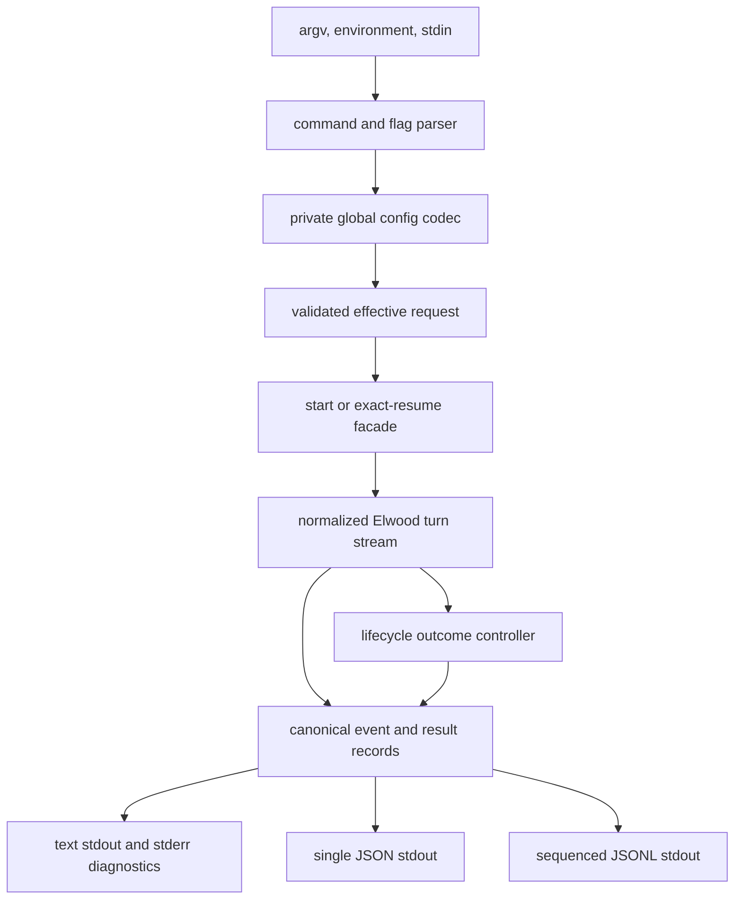
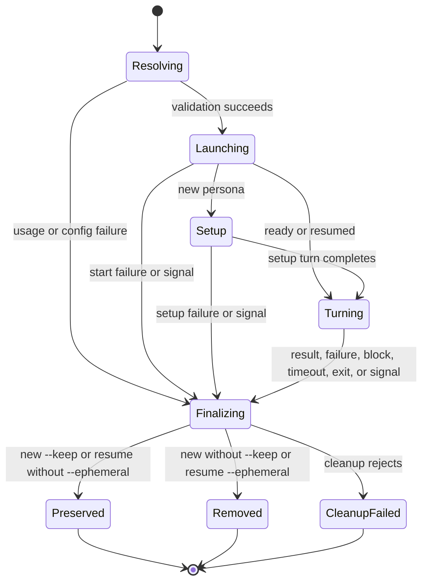

# Elwood Headless CLI - Plan

## Goal Capsule

- **Objective:** Developers can run Claude Code or Codex from a shell script through one predictable command and receive an answer that composes cleanly with Unix tools.
- **Means:** Add a compiled first-party `elwood` executable over the existing session and turn APIs, with global configuration, explicit continuation, and stable output protocols (KTD1-KTD6).
- **Product authority:** `PRD.md` defines observable library and CLI behavior; this plan must update it before implementation.
- **Execution profile:** Implement all units in dependency order, retain the repository's 100% coverage gate, and use the opt-in live suite for real-agent behavior.
- **Stop conditions:** Stop only for evidence that invalidates the Product Contract or requires a new security boundary.
- **Tail ownership:** Complete implementation, review, verification, commits, and local `main` landing without changing unrelated user work.

---

## Product Contract

The Product Contract below preserves the original requirements-only artifact's intent and stable IDs. Planning research tightened ambiguous behavior in place and added R37-R42 for requirements that the original draft implied but did not own.

### Summary

Elwood will provide a headless command that accepts a prompt, runs one agent turn, and prints the final response. The shortest form is `elwood "prompt"`; explicit commands, configuration, streaming, structured output, and resume controls cover scripting and advanced use.

### Problem Frame

Elwood already turns interactive Claude Code and Codex sessions into typed `send()` and `stream()` calls, but shell users must still write TypeScript to use them. The developer test app mirrors terminal output and is unsuitable for pipelines. A production CLI needs stable input, output, lifecycle, and install boundaries so shell composition is dependable.

### Key Decisions

- **Hybrid command surface.** `elwood "prompt"` is the primary path and `elwood run "prompt"` is its explicit equivalent. Governs R2.
- **Single-shot by default.** (session-settled: user-approved — chosen over strict one-shot-only and automatic conversation persistence: it keeps the common invocation simple while retaining explicit continuation.) Governs R17, R18.
- **Stdout is an output protocol.** Human diagnostics never share stdout with the selected result format. Governs R19-R26, R39.
- **No silent agent fallback.** Predictability is more valuable than making a different installed agent run unexpectedly. Governs R4, R18.
- **Global configuration only in v1.** Repository-controlled configuration is excluded because opening an untrusted checkout must not silently broaden agent permissions. Governs R27-R31, R37-R38.
- **Headless means non-interactive.** Known trust and permission prompts are answered or failed according to policy rather than left waiting forever. Governs R11-R14.

### Actors

- A1. **Shell user:** invokes Elwood directly and reads human-facing diagnostics.
- A2. **Script or pipeline:** supplies prompt context and consumes a stable stdout protocol plus exit status.
- A3. **Agent CLI:** Claude Code or Codex running through Elwood's interactive PTY control layer.

### Requirements

**Command and input surface**

- R1. The package exposes a compiled-JavaScript executable named `elwood` that runs under the repository's supported Node.js and macOS runtime after local, git, or tarball installation.
- R2. `elwood [options] [prompt...]` and `elwood run [options] [prompt...]` have identical execution behavior; `help`, `run`, and `config` are reserved only as the first argument before `--`.
- R3. `elwood help`, `elwood --help`, and `elwood --version` write metadata and complete without reading configuration or launching an agent.
- R4. New sessions select an agent through configuration precedence with built-in default `codex`; an unavailable selected agent fails without fallback.
- R5. New sessions use the invocation directory unless `-C` or `--cwd` selects another directory; resumes use the recorded directory unless an explicit cwd overrides it.
- R6. Positional prompt words are joined with spaces, non-empty piped stdin is appended after one blank line, and terminal stdin is never read.
- R7. An empty or whitespace-only combined prompt prints concise usage to stderr and exits as a usage error without launching an agent.
- R8. Combined text is limited to 8 MiB of UTF-8 data and an oversized input fails incrementally before an agent starts.
- R9. Repeatable `--image <path>` options attach readable image files in flag order to the same observed turn; paths resolve from the effective workspace.

**Agent execution and lifecycle**

- R10. One execution uses Elwood's established turn boundary and preserves the selected cwd, login-shell environment, instructions, user and project settings, skills, MCP configuration, and hooks.
- R11. CLI invocation authorizes only the workspace-directory and extension trust classes in `src/core/trust-prompts.ts` by default; `--no-trust` disables that authorization but still permits Codex's required Elwood-owned hook trust, and every other recognized prompt fails as `blocked_prompt`.
- R12. The built-in posture is non-interactive without disabling the sandbox: Claude uses `dontAsk`, while Codex uses `workspace-write` and approval policy `never`.
- R13. Flags and global configuration can set model, reasoning effort, persona, state directory, Claude permission mode, Codex sandbox, and Codex approval policy; agent-specific options reject incompatible agents.
- R14. A recognized blocking prompt that policy will not answer fails with `blocked_prompt`, reports only its stable rule label, and enters lifecycle cleanup instead of waiting.
- R15. Turns have no whole-turn timeout by default so long-running agent work is not guessed to be stalled; `--timeout <duration>` accepts positive safe integers with `ms`, `s`, `m`, or `h` units.
- R16. Signal handlers are installed before launch: first `SIGINT` requests interruption and cleanup, repeated `SIGINT` force-kills, and interrupted execution exits 130.
- R17. A new invocation tears down state after every outcome unless `--keep` preserves it with stop-or-kill cleanup; text mode reports the preserved ID on stderr, and preserved records remain until resumed with `--ephemeral` or removed manually in v1.
- R18. `--resume <id>` loads the exact stored adapter and cwd without falling back to a new conversation, preserves the session after every outcome unless `--ephemeral` is present, and rejects an explicit conflicting agent; before launch, the stored adapter must be known and the stored cwd must be an absolute existing directory owned by the invoking user.
- R36. A response collected before cleanup failure remains available; cleanup failure never masks a primary error but makes an otherwise successful invocation exit 1.
- R40. CLI-owned session state defaults to `$XDG_STATE_HOME/elwood` when the variable is absolute, otherwise `~/.local/state/elwood`, so ephemeral runs do not create workspace files; CLI state directories and records are private, regular, owner-matched, symlink-safe, and atomically written.
- R41. An agent process that exits before the CLI-requested cleanup is an `agent_exited` failure even when the process status is zero; collected response data remains available.
- R42. A persona config applies only to new sessions and adds a separate discarded setup turn before the user turn; explicit persona on resume is a usage error. Setup failures use the same outcomes as user-turn failures, and the invocation timeout and reported duration span launch, setup, and the user turn together.

**Output protocols**

- R19. Default text mode writes only the final assistant response to stdout, adds one trailing newline to non-empty output, emits no ANSI sequences, and writes nothing else there.
- R20. A successful turn with no assistant text writes zero stdout bytes in text mode, emits a result with an empty response in JSON and JSONL, and exits 0.
- R21. Human-readable warnings, failures, cleanup diagnostics, preserved-session notices, and progress go to stderr; structured warning and error records required by R24-R25 remain on stdout.
- R22. `--verbose` adds readable lifecycle and normalized turn progress to stderr without changing stdout.
- R23. `--stream` is valid only with text output, emits assistant chunks once with blank lines between distinct messages, adds one final newline when non-empty, and preserves partial bytes on failure.
- R24. `--output json` writes one version-1 result or error document with type, agent, response, nullable session ID, integer duration, and exact cleanup metadata.
- R25. `--output jsonl` writes monotonically sequenced version-1 normalized text, thinking, tool, status, and warning records followed by exactly one terminal result or error record containing the accumulated response.
- R26. Production output never contains raw PTY frames, raw hook payloads, screen contents, stacks, bridge credentials, or terminal escape sequences.
- R39. All stdout writes honor backpressure; a downstream `EPIPE` stops further output, cleans up the agent, and exits without an uncaught diagnostic. Consumer closure exits 0 unless a nonzero primary outcome was already established.

**Global configuration**

- R27. User configuration resolves from non-empty `$ELWOOD_CONFIG`, otherwise absolute non-empty `$XDG_CONFIG_HOME/elwood/config.json`, otherwise `~/.config/elwood/config.json`; relative XDG bases are ignored.
- R28. Configuration is a strict version-1 JSON object containing only documented defaults and per-agent launch settings; it cannot set prompt, cwd, keep, ephemeral, resume ID, or images.
- R29. Precedence is command-line flags, supported `ELWOOD_*` environment variables, user configuration, then built-in defaults.
- R30. `elwood config path`, `show`, `get`, `set`, and `unset` manage dotted documented keys without launching an agent; writes are atomic, owner-only, and symlink-safe.
- R31. V1 does not read project-local Elwood CLI configuration.
- R37. Config keys are `schemaVersion`, `agent`, `output`, `timeout`, `trust`, `stateDir`, `verbose`, `stream`, `persona`, `claude.model`, `claude.reasoningEffort`, `claude.permissionMode`, `codex.model`, `codex.reasoningEffort`, `codex.sandbox`, and `codex.approvalPolicy`.
- R38. Supported environment variables are `ELWOOD_AGENT`, `ELWOOD_OUTPUT`, `ELWOOD_TIMEOUT`, `ELWOOD_TRUST`, `ELWOOD_STATE_DIR`, `ELWOOD_VERBOSE`, `ELWOOD_STREAM`, `ELWOOD_PERSONA`, `ELWOOD_MODEL`, `ELWOOD_REASONING_EFFORT`, `ELWOOD_CLAUDE_PERMISSION_MODE`, `ELWOOD_CODEX_SANDBOX`, and `ELWOOD_CODEX_APPROVAL_POLICY`; booleans accept only `true` or `false`.

**Failures and compatibility**

- R32. Exit status is `0` for completion or consumer closure, `1` for agent or cleanup failure, `2` for usage or configuration failure, `124` for timeout, and `130` for interruption. A non-success primary outcome keeps its status if cleanup also fails; cleanup failure changes an otherwise successful invocation to 1.
- R33. Text-mode errors are concise on stderr; `--verbose` may add a sanitized stack trace without exposing secrets or raw agent screens.
- R34. A parseable explicit structured-output selection represents validation and runtime errors in that stdout protocol while retaining R32's nonzero exit status.
- R35. Arguments, environment, configuration, cwd, images, and incompatible option combinations are validated before session creation whenever validation does not require stored resume state.

### Key Flows

- F1. **Direct single-shot query**
  - **Trigger:** A1 runs `elwood "Summarize this repository"`.
  - **Actors:** A1, A3.
  - **Steps:** Elwood resolves defaults, launches Codex in the current directory, runs one turn, tears down the global session state, and prints the response.
  - **Outcome:** The shell receives only the answer on stdout.
  - **Covers:** R2, R4-R5, R10-R12, R17, R19, R40.
- F2. **Pipeline with contextual stdin**
  - **Trigger:** A2 pipes content into a positional instruction.
  - **Actors:** A2, A3.
  - **Steps:** Elwood composes the instruction and stdin, runs the selected agent, and returns the chosen output protocol with backpressure.
  - **Outcome:** The command composes without log or terminal contamination.
  - **Covers:** R6, R19-R26, R39.
- F3. **Preserved continuation**
  - **Trigger:** A1 uses `--keep`, then passes the reported ID to `--resume` from the same or another directory.
  - **Actors:** A1, A3.
  - **Steps:** Elwood stores state globally, infers the adapter and recorded cwd, continues exactly that session, and preserves or tears it down according to lifecycle flags.
  - **Outcome:** Explicit continuation retains context without making new invocations persistent.
  - **Covers:** R17-R18, R24-R25, R40.
- F4. **Configuration management**
  - **Trigger:** A1 invokes an `elwood config` command.
  - **Actors:** A1.
  - **Steps:** Elwood resolves the config path, validates a documented key and typed value, then reads or atomically updates the private file.
  - **Outcome:** Future invocations use the configured defaults without launching an agent.
  - **Covers:** R27-R31, R35, R37-R38.
- F5. **Blocking, timeout, or interruption**
  - **Trigger:** A3 blocks on a recognized prompt, the explicit deadline expires, or A1 signals the process.
  - **Actors:** A1, A3.
  - **Steps:** The lifecycle controller records one primary outcome, prevents further submission/output, interrupts or kills, and performs the selected cleanup exactly once.
  - **Outcome:** The invocation terminates with one documented exit status and no orphaned process tree.
  - **Covers:** R14-R18, R32-R36, R41.

### Acceptance Examples

- AE1. **Covers R2, R19.** Given default configuration, when a response is `ok`, stdout is exactly `ok\n`, stderr is empty absent warnings, and status is 0.
- AE2. **Covers R6.** Given stdin `diff contents\n`, piping it to positional instruction `Review this diff` sends `Review this diff\n\ndiff contents\n` as one turn.
- AE3. **Covers R7, R32.** Given terminal stdin and no positional input, execution prints usage to stderr, launches no agent, and exits 2.
- AE4. **Covers R22.** Given `--verbose`, lifecycle progress appears on stderr while stdout matches non-verbose text mode byte-for-byte.
- AE5. **Covers R24, R34.** Given explicit JSON output and a startup failure, stdout contains one version-1 error document and status is 1.
- AE6. **Covers R25.** Given JSONL output with thinking, tool, text, and warning activity, records have increasing sequence values and exactly one terminal result follows.
- AE7. **Covers R11, R14.** Given a new workspace, default trust answers an allowlisted prompt; `--no-trust` instead fails with the stable rule label and never submits into the dialog.
- AE8. **Covers R17-R18, R40.** Given a successful text-mode `--keep`, stderr reports an ID that `--resume` continues even when the configured default agent differs from the record.
- AE9. **Covers R15, R32.** Given `--timeout 5m`, no boundary within five minutes causes cleanup and status 124.
- AE10. **Covers R29.** Given conflicting built-in, config, environment, and flag values, the flag wins, then environment, config, and built-in.
- AE11. **Covers R36.** Given a response followed by teardown failure, the response remains in the selected protocol, cleanup is failed, and status is 1.
- AE12. **Covers R9.** Given two readable image flags, the agent receives both in flag order on the same user turn.
- AE13. **Covers R18.** Given `--resume` for a Claude record while defaults select Codex, Elwood resumes Claude; an explicit `--agent codex` fails as usage.
- AE14. **Covers R23, R39.** Given streamed partial text followed by timeout or closed downstream stdout, emitted bytes are not replayed and the agent is cleaned up without a stack trace.
- AE15. **Covers R41.** Given the agent exits before a completion boundary after partial text, structured output contains the partial response and an `agent_exited` error.
- AE16. **Covers R42.** Given a configured persona on a new session, its response is discarded before the user's response is observed; explicit persona plus resume fails before launch.
- AE17. **Covers R32, R34.** Given explicit JSON output and an invalid flag combination, stdout contains one version-1 error document, stderr has no duplicate diagnostic, and status is 2.

### Success Criteria

- A shell user can install or link the package and run one useful turn without TypeScript or configuration.
- Text output works in command substitution and pipelines without log or ANSI cleanup.
- Every non-interactive terminal path has one documented status, one cleanup attempt, and no orphaned agent process.
- Claude and Codex share one common surface while retaining explicit adapter launch policy.
- The standard gate retains 100% line, branch, function, and statement coverage.

### Scope Boundaries

#### Deferred to Follow-Up Work

- Named sessions and automatic “resume the latest session” aliases.
- CLI management of recurring loops already supported by the library.
- Shell completion generation and package-manager-specific installers.
- Project-local configuration after a separate trust model is designed.
- A cross-process lease for concurrent resume of the same session identity; v1 documents that one identity has at most one live owner and fails on the underlying startup conflict.
- Session listing, pruning, and expiry commands; v1 preserved records must be reclaimed by retaining their ID and resuming with `--ephemeral`, or by manual removal.
- Unification of the CLI-global state root with the library's existing default workspace-local state root; cross-surface resume is not supported in v1.

#### Outside this Product's Identity

- A replacement interactive terminal UI for Claude Code or Codex.
- A long-running daemon, background job queue, or remote execution service.
- Raw pass-through access to the underlying PTY as a production output mode.
- Silent selection of a different agent or a fresh conversation after failure.
- Automation of browser authentication or another human-gated consent flow.

### Dependencies / Assumptions

- Claude Code or Codex is installed and authenticated in the user's interactive login shell.
- The supported runtime remains macOS and Node.js 24 or newer for this slice.
- Config and CLI state roots are same-user data; project files cannot configure execution posture.
- Piped stdin is composed into agent instructions and may contain prompt injection; callers should not pipe untrusted content while enabling workspace trust or broader agent permissions.
- Image paths intentionally may resolve outside the effective workspace; callers must not interpolate untrusted paths.
- The existing adapter shutdown layer remains responsible for reaping PTYs, bridges, and descendant processes.

---

## Planning Contract

### Key Technical Decisions

- KTD1. **Emit ESM with TypeScript rather than run source from the package.** A build-only config rewrites `.ts` imports to `.js`, emits declarations, and places the shebang bin at `dist/cli/entry.js`; Node refuses native TypeScript loading under `node_modules`, and plain compiler output keeps `node-pty` external. Supports R1.
- KTD2. **Use a small command pipeline with injected process and session seams.** Parsing, config, input, session creation, execution, and rendering remain separate modules under 200 lines; tests exercise behavior without authenticated agents. Supports R2-R9, R27-R38.
- KTD3. **Extend the normalized turn path instead of parsing transcripts.** `TurnOptions` gains image attachments, and a CLI-local lazy facade launches or resumes exactly one adapter through `SessionBase`; persona setup finishes before user-turn observation. Supports R9-R10, R18, R42.
- KTD4. **Serialize one canonical execution model into every output mode.** Text, JSON, and JSONL renderers share result, error, cleanup, and normalized-event records; only renderers own stdout. Supports R19-R26, R34, R36, R39, R41.
- KTD5. **Centralize lifecycle ownership.** One controller records primary outcome precedence, installs signals before launch, detects attention and premature exit, and performs stop, kill, or teardown once. Supports R14-R18, R32-R36, R41.
- KTD6. **Keep config and state in separate XDG roots.** Config is strict user preference data under the config root; session records use a global state root so default runs never modify the workspace. Supports R27-R31, R37-R40.

### High-Level Technical Design

The diagrams define boundaries and ordering. Exact class and helper names remain implementation details.





| Mode | Live stdout | Terminal stdout | Stderr |
|---|---|---|---|
| Text | Assistant text only with `--stream` | Buffered assistant text otherwise | Warnings, failures, preserved ID, verbose progress |
| JSON | None | One result or error document | Human diagnostics only |
| JSONL | Normalized sequenced records | Exactly one result or error record | Human diagnostics only |

```text
elwood help | --help | --version
elwood config (path | show | get KEY | set KEY VALUE | unset KEY)
elwood [run] [OPTIONS] [--] [PROMPT...]
```

### Output Structure

```text
src/cli/
  args.ts
  config/
    codec.ts
    commands.ts
    paths.ts
    store.ts
  entry.ts
  main.ts
  input.ts
  lifecycle.ts
  output/
    json.ts
    jsonl.ts
    text.ts
    types.ts
  request.ts
  run.ts
  session.ts
  stream.ts
  types.ts
  version.ts
tests/cli/
  ...focused unit and process-level suites...
```

### Implementation Constraints

- Every source and test file stays below 200 lines and begins with the required docstring.
- Public types remain readonly and exports remain named; only the executable entry performs top-level process work.
- Async stdout writes must settle before normal exit; the entry sets `process.exitCode` instead of forcing process exit after output.
- Config reads reject non-regular, symlinked, wrong-owner, or non-private files; atomic writes use same-directory private temporary files and rename.
- Structured records expose only normalized portable fields; they never serialize `raw`, a stack, terminal screen text, or hook payloads.
- Lifecycle tests inject time, signal delivery, session events, and output sinks so signal, timeout, agent-exit, and `EPIPE` races are deterministic; `src/cli/` uses no coverage-ignore pragmas.
- Live-agent verification stays outside `npm run check`; deterministic fake-session and subprocess tests own the 100% gate.

### Sequencing

1. Establish the PRD, shared types, packaging boundary, and test seams.
2. Resolve command, config, environment, paths, and prompt input before session work.
3. Add exact start/resume and image-aware normalized turns.
4. Build canonical records and output renderers.
5. Integrate lifecycle execution, signals, attention, exits, and cleanup.
6. Wire the executable and config commands, then re-verify the installed artifact end to end.
7. Document public use and add opt-in live smoke coverage.

### System-Wide Impact

- **Package consumers:** Emitted JS and declarations become the installed package boundary; local source tests remain unchanged.
- **Adapter parity:** The common CLI request maps to existing adapter-specific posture without bypassing shell context or user hooks.
- **State lifecycle:** CLI sessions move from implicit workspace-local state to an explicit user-global state root; library defaults do not change.
- **Privacy:** Structured events can include assistant reasoning and tool data, so the serializer admits a fixed normalized subset and never raw payloads.
- **State separation:** CLI-global and library-default stores are intentionally separate in v1; resume identities do not cross those surfaces.
- **Process ownership:** Signal, timeout, block, exit, and cleanup paths converge on one owner to avoid double teardown and orphan races.

### Risks & Dependencies

- **Native dependency packaging:** Compiling rather than bundling leaves `node-pty` as an ordinary dependency. Verify the installed tarball, not only `dist` in place.
- **Signal during lazy startup:** `kill()` is a no-op before the facade has a live session. The lifecycle controller must join the in-flight launch and clean any session that materializes.
- **Blocking before submission:** Startup attention can precede facade availability. The common seam needs a sticky attention snapshot or replay so recognized unanswered prompts cannot be lost.
- **Premature terminal status:** The normalized turn runner can end on terminal status. Track `terminal:exit` and distinguish it from CLI-owned cleanup.
- **Resume configuration:** Stored adapter and cwd are authoritative; state root resolution must happen before adapter inference and never fall back to start.
- **Output backpressure:** Streaming writes can outlive the producer callback. Serialize writes and treat `EPIPE` as downstream closure.
- **Persona activity:** Launch-time persona can overlap with user-turn observation. Execute it as a distinct setup turn or omit it on resume.

### Sources / Research

- `src/core/simple/session.ts`, `src/core/simple/turn.ts`, and `src/core/simple/events.ts` define the turn facade and normalized event boundary.
- `src/claude/session-resume.ts`, `src/codex/session-resume.ts`, and `src/state/store.ts` define exact resume records and stored adapter/cwd authority.
- `src/core/trust-prompts.ts`, `src/core/attention.ts`, and adapter screen tables define allowlisted automation and stable blocking labels.
- `src/runtime/session-base.ts` and `src/runtime/session-shutdown.ts` own process-tree cleanup beneath the CLI.
- `src/app/test-app.ts` is a parsing and event-wiring precedent, but raw terminal mirroring is intentionally not reused.
- [Node TypeScript support](https://nodejs.org/api/typescript.html#type-stripping-in-dependencies) requires emitted JavaScript for installed packages.
- [npm package bins](https://docs.npmjs.com/cli/v11/configuring-npm/package-json/#bin) require a Node shebang and install the declared executable link.
- [npm lifecycle scripts](https://docs.npmjs.com/cli/v11/using-npm/scripts/#prepare-and-prepublish) supports TypeScript compilation in `prepare` for local and git installs.
- [Node process I/O and exit](https://nodejs.org/api/process.html#processexitcode) requires graceful drain instead of immediate `process.exit()` after writes.
- [XDG Base Directory Specification](https://specifications.freedesktop.org/basedir-spec/latest/) defines absolute base paths and config/state fallbacks.

---

## Implementation Units

### U1. Specify and package the installed CLI boundary

- **Goal:** Make the observable CLI contract authoritative and establish emitted-JavaScript packaging.
- **Requirements:** R1-R3, R40.
- **Dependencies:** None.
- **Files:** `PRD.md`, `package.json`, `tsconfig.build.json`, `scripts/postbuild.mjs`, `tests/unit/package-scripts.test.ts`, `tests/cli/package.test.ts`.
- **Approach:**
  1. Add the CLI section and conformance IDs to the PRD before behavior code.
  2. Emit ESM plus declarations into `dist`, rewrite import extensions, preserve the Node shebang, and expose `dist/cli/entry.js` as the package bin.
  3. Run the build during local and git package preparation while keeping registry publication out of scope.
  4. Make a packed-tarball install/import/help smoke a blocking exit criterion before later units rely on the packaging design.
- **Patterns to follow:** Existing strict compiler flags, package-script assertions, and Node supervisor entry guards.
- **Test scenarios:**
  - Covers AE1. A built entry reports help and version without importing an agent runtime path that starts a session.
  - A dry-run package manifest includes the JS bin and declaration output but does not require executable TypeScript.
  - An installed tarball exposes an executable `elwood` link and imports the library entry successfully.
- **Verification:** The emitted artifact runs under the declared Node floor and package metadata points only at files present after build.

### U2. Resolve commands, configuration, environment, and prompt input

- **Goal:** Produce one validated effective request before any session exists.
- **Requirements:** R2-R9, R13, R15, R27-R31, R35, R37-R40; F2, F4.
- **Dependencies:** U1.
- **Files:** `src/cli/args.ts`, `src/cli/input.ts`, `src/cli/request.ts`, `src/cli/types.ts`, `src/cli/config/codec.ts`, `src/cli/config/paths.ts`, `src/cli/config/store.ts`, `tests/cli/args.test.ts`, `tests/cli/input.test.ts`, `tests/cli/request.test.ts`, `tests/cli/config.test.ts`.
- **Approach:**
  1. Parse the hybrid grammar and retain whether high-precedence values were explicit.
  2. Decode the strict config and environment surfaces into the same typed option model.
  3. Apply precedence, adapter compatibility, path resolution, timeout parsing, stdin composition, and incremental byte limits before returning a request.
- **Execution note:** Start with table-driven validation tests because branch coverage is a hard gate.
- **Patterns to follow:** Closed literal arrays in adapter validators, typed Elwood errors, state file safety helpers, and invocation-cwd path snapshots.
- **Test scenarios:**
  - Covers AE2 and AE3. Positional-only, stdin-only, combined, empty, whitespace-only, TTY, UTF-8 boundary, and oversized input resolve correctly.
  - Reserved first arguments, explicit `run`, `--`, repeated images, short cwd, equals-form options, unknown options, and incompatible combinations resolve or reject deterministically.
  - Covers AE10. Each flag, environment, config, and built-in collision follows precedence, including strict booleans and agent-specific rejection.
  - Config path resolution handles explicit relative override, absolute XDG roots, ignored relative XDG roots, and homedir fallbacks.
  - Missing config is empty defaults; corrupt, unknown-version, unknown-key, symlinked, wrong-owner, and non-private config fails as configuration error.
- **Verification:** Every static error occurs before the injected session factory is called and yields a sanitized typed reason.

### U3. Support image-aware turns and exact lazy resume

- **Goal:** Reuse the normalized turn boundary for images, new sessions, setup persona, and exact resumes.
- **Requirements:** R4-R5, R9-R13, R18, R40, R42; F1, F3.
- **Dependencies:** U2.
- **Files:** `src/core/simple/turn-types.ts`, `src/core/simple/turn.ts`, `src/state/store.ts`, `src/cli/session.ts`, `tests/unit/simple-session.test.ts`, `tests/cli/session.test.ts`.
- **Approach:**
  1. Add images to the public turn options and forward them through the existing serialized `sendMessage` operation.
  2. Create adapter-specific lazy facades that choose start or exact resume and expose normalized subscriptions without fallback.
  3. Give new launches a recoverable identity before adapter startup, replay startup attention after launch, and ensure rejected starts can still honor keep/teardown policy.
  4. Inspect and securely validate the stored record before resume, enforce explicit adapter conflicts, preserve stored cwd defaults, and apply explicit model changes before the user turn when required.
  5. Run configured persona as a completed setup turn only for new sessions.
- **Patterns to follow:** `SessionBase`, adapter boundary-signal assertions, `readSessionRecord`, and start/resume posture merging.
- **Test scenarios:**
  - Covers AE12. Image paths reach `sendMessage` in order on the same normalized turn, including invalid image rejection.
  - Covers AE13. A Claude record resumes under Codex defaults, while explicit conflicting agent and absent, corrupt, symlinked, non-private, or hostile-cwd state fails without start fallback.
  - Covers AE16. Persona response activity completes and is discarded before the user response; resume does not replay configured persona.
  - Explicit model on resume invokes the established model switch before the user prompt; reasoning effort remains a resume launch option.
- **Verification:** CLI execution can use one `send` or `stream` abstraction for all supported new/resume/image cases without parsing transcript or terminal data.

### U4. Define canonical output records and renderers

- **Goal:** Keep all output modes byte-stable and derived from one safe execution model.
- **Requirements:** R19-R26, R33-R34, R36, R39, R41; F2.
- **Dependencies:** U2, U3.
- **Files:** `src/cli/output/types.ts`, `src/cli/output/text.ts`, `src/cli/output/json.ts`, `src/cli/output/jsonl.ts`, `src/cli/stream.ts`, `tests/cli/output.test.ts`, `tests/cli/stream.test.ts`.
- **Approach:**
  1. Define the version-1 result, error, cleanup, and normalized event records with exhaustive discriminants.
  2. Route every write through an async backpressure-aware sink that latches downstream closure.
  3. Render text, JSON, and JSONL from the shared records and enforce one terminal record.
  4. Redact Elwood-minted bridge credentials from every canonical string before accumulation or rendering.
- **Patterns to follow:** Public readonly unions, normalized `TurnEvent`, activity projection without `raw`, and exhaustive switches.
- **Test scenarios:**
  - Covers AE1, AE4-AE6. Text, verbose text, JSON, and JSONL preserve stdout separation and exact schema/order.
  - Empty response emits zero text bytes; distinct text messages receive blank-line separation and one final newline.
  - Covers AE14. Partial streaming failure retains prior bytes, emits no duplicate, and a simulated `EPIPE` closes output without a stack.
  - Error serialization excludes stacks, raw objects, screen text, tokens, and bridge credentials even under verbose mode.
- **Verification:** Parity tests prove every renderer describes the same response, session, duration, primary outcome, and cleanup outcome.

### U5. Coordinate execution, signals, blocking, exits, and cleanup

- **Goal:** Give every terminal path one outcome and one complete lifecycle cleanup.
- **Requirements:** R10-R18, R32-R36, R39-R42; F5.
- **Dependencies:** U3, U4.
- **Files:** `src/cli/lifecycle.ts`, `src/cli/run.ts`, `tests/cli/lifecycle.test.ts`, `tests/cli/run.test.ts`.
- **Approach:**
  1. Install injected signal hooks before session creation and record primary outcome precedence once.
  2. Subscribe to status, warning, attention, and terminal-exit events before launch.
  3. Execute optional persona then the user turn while collecting canonical records.
  4. On block, timeout, exit, signal, or output closure, interrupt or kill as applicable and join lazy startup before final cleanup.
  5. Preserve with close or remove with teardown according to new/resume lifecycle policy, recording cleanup independently from the primary outcome.
  6. Drive long deadlines from an absolute clock and arm bounded timer slices no larger than Node's maximum timer delay.
- **Execution note:** Implement the lifecycle matrix test-first; signal and cleanup races are the highest-risk slice.
- **Patterns to follow:** Runtime shutdown coordination, attempt-all teardown, terminal status absorption, and typed error precedence.
- **Test scenarios:**
  - Covers AE7 and AE9. Pre-submission attention and turn timeout terminate, clean up, and map to the expected code.
  - First SIGINT during startup and during a turn requests interruption; a second signal force-kills; both finish with 130.
  - New failure tears down by default, resume failure preserves by default, and explicit keep/ephemeral overrides select the documented cleanup.
  - Covers AE11. Cleanup rejection records failure without replacing response or a higher-precedence primary error.
  - Covers AE15. Exit before content, after partial content, and after boundary are distinguished from CLI-owned shutdown.
  - Output closure during a turn stops production and reaps the session once.
  - Injected time, signal, sink, and session seams deterministically cover repeated signals, mid-write `EPIPE`, and exit during cleanup.
- **Verification:** No matrix branch leaves a fake session live, emits two terminal records, or changes a primary exit code because cleanup also failed.

### U6. Wire commands and the production entrypoint

- **Goal:** Expose the complete CLI through one thin executable boundary.
- **Requirements:** R1-R5, R17-R18, R21-R22, R24-R25, R27-R35, R37-R38; F1, F3, F4.
- **Dependencies:** U2, U5.
- **Files:** `src/cli/config/commands.ts`, `src/cli/version.ts`, `src/cli/main.ts`, `src/cli/entry.ts`, `tests/cli/config-commands.test.ts`, `tests/cli/main.test.ts`, `tests/cli/entry.test.ts`.
- **Approach:**
  1. Implement config path/show/get/set/unset over the typed store with shell-friendly scalar reads and silent successful mutation.
  2. Route metadata, config, and run commands without importing side effects.
  3. Bind real process streams and signals only in the shebang entry, await all writes, set `process.exitCode`, and remove listeners.
- **Patterns to follow:** `src/app/dev.ts` entry guard and argument delegation, without its raw terminal mirroring.
- **Test scenarios:**
  - Config show/get/set/unset cover absent files, typed values, dotted keys, idempotent unset, atomic replacement, and permissions.
  - Covers AE17. Help and version bypass config/session; validation errors choose text or an explicitly parseable JSON/JSONL protocol and retain status 2.
  - Covers AE8. Text keep reports the ID on stderr; structured keep and resume place it in terminal records.
  - A process-level fake-session run verifies stdout/stderr bytes and all documented exit statuses.
- **Verification:** The executable is a thin adapter over tested command logic and leaves no pending process listeners or unwritten output.

### U7. Document and smoke-test real CLI behavior

- **Goal:** Make the CLI discoverable and protect its real-agent boundaries without slowing the default gate.
- **Requirements:** Documentation coverage for R1-R42; live verification of R1, R10-R12, R17-R18, R19, R26, R32, and R40; F1-F5.
- **Dependencies:** U6.
- **Files:** `README.md`, `CHANGELOG.md`, `docs/cli-behavior.md`, `tests/e2e/cli.e2e.ts`.
- **Approach:**
  1. Document install/link, direct and explicit usage, stdin/images, configuration, structured protocols, exit statuses, state/resume, trust, and security posture.
  2. Record only new empirically learned agent-CLI behavior in the behavior guide.
  3. Add opt-in real Claude and Codex smoke flows for trust, context, completion, keep/resume, and cleanup.
- **Test scenarios:**
  - A real direct turn returns only final assistant text with no terminal frames.
  - A real default-trust workspace starts headlessly, while no-trust fails at the recognized startup prompt.
  - A real keep then separate-process resume preserves context and tears down when ephemeral is requested.
  - Context smoke fixtures confirm project instructions and normal login-shell environment remain visible.
  - README and help collectively name every documented flag, config key, environment variable, and exit status.
- **Verification:** README examples match help text and the opt-in live suite validates version-coupled behavior independently of deterministic unit coverage.

---

## Verification Contract

| Gate | Applies to | Required outcome |
|---|---|---|
| `npm run build` | U1-U7 | ESM, declarations, and executable bin emit without TypeScript errors. |
| `npm run typecheck` | U1-U7 | Strict TypeScript passes with no unchecked or unused values. |
| `npm run lint` | U1-U7 | Biome formatting and lint checks pass. |
| `npm run check:lines` | U1-U7 | Every checked code file is at most 200 lines. |
| `npm test` | U1-U7 | All deterministic tests pass at 100% lines, functions, statements, and branches. |
| Installed-package smoke | U1, U6 | A real tarball install exposes the bin and library import without TypeScript runtime loading. |
| `npm run test:e2e` | U7 | Opt-in authenticated Claude and Codex flows pass for the installed local environment. |
| `npm run check` | Final | The repository's standard combined gate passes unchanged apart from adding the build prerequisite. |

Process-level tests must run the real compiled entry with an injected fake session boundary. They must assert exact stdout bytes, stderr routing, exit status, listener cleanup, and absence of ANSI sequences. Live tests may depend on authenticated local agents and remain outside the default coverage gate.

---

## Definition of Done

- R1-R42 are implemented in `PRD.md`, source, help text, README, tests, and changelog without contradictory defaults.
- U1-U7 satisfy their verification outcomes and every applicable acceptance example has deterministic coverage.
- A built and installed package runs `elwood --help`, `elwood --version`, and an injected headless turn without executing TypeScript from `node_modules`.
- Text, JSON, and JSONL maintain one safe stdout protocol across success, empty output, warning, failure, timeout, interrupt, block, premature exit, `EPIPE`, and cleanup failure.
- New, keep, resume, and ephemeral lifecycle paths leave the intended global state and no owned process tree.
- Config and state paths are private, absolute, symlink-safe, and never sourced from project-local execution posture.
- `npm run check` passes at 100% coverage and all checked files remain under 200 lines.
- Applicable real-agent smoke coverage passes or is reported separately with its environment dependency.
- Simplification and code review findings are resolved before the final commit.
- Dead-end helpers, abandoned packaging experiments, generated tarballs, temporary state, and other implementation residue are removed.
- Unrelated user work, including `TODO.md`, remains untouched and uncommitted.
